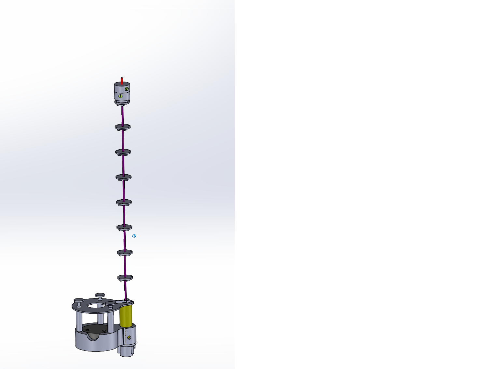
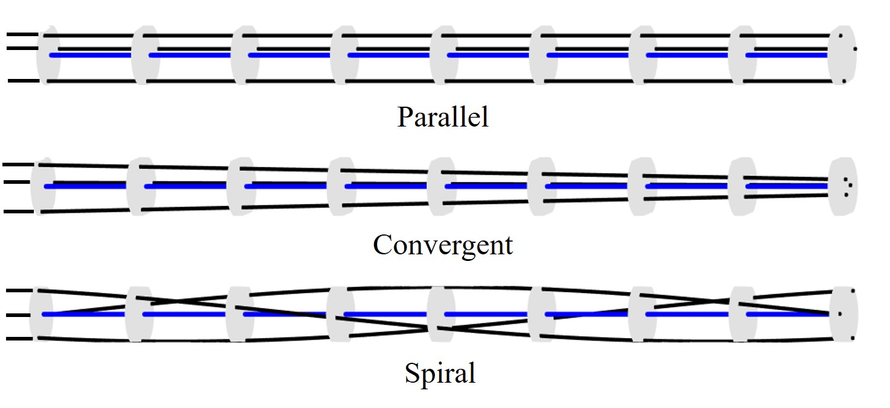

# Modeling and Shape Prediction of Tendon-Actuated Continuum Robots with Experimental Validation

This project presents the modeling, shape prediction, and experimental validation of a tendon-actuated continuum robot developed during my PhD research.

## Overview

Continuum robots are promising for minimally invasive surgery and manipulation in constrained environments.  

In such environments, continuous and accurate knowledge of the nonlinear TACR shape is essential to ensure safe guidance.Although this problem has been extensively investigated and several models have been proposed, there remains strong interest in developing
a compact model enabling fast shape prediction.

This repository presents part of my PhD research on tendon-actuated continuum robots, focusing on physically-based modeling using Cosserat rod theory, reduced-order actuation modeling, real-time shape prediction from tendon tension measurements, and experimental validation.

## Key Contributions

- Developed a **3D nonlinear mechanical model of tendon-actuated continuum robots based on Cosserat rod theory**.
- Proposed a **shape prediction framework using actuated strain modes (ASM)** that enables direct shape reconstruction from tendon tension measurements.
- Derived an **analytical construction of an actuation-adapted strain basis** for continuum robots with arbitrary tendon routing.
- Developed an **SVD-based method for eliminating actuation redundancy** for tendon-actuated continuum robots.
- Designed and built a **single-segment tendon-actuated continuum robot prototype platform** for experimental validation.
- Performed **extensive experimental validation for multiple tendon routing paths (parallel, convergent, spiral)**.

## Mechanical Modeling

The robot is modeled using Cosserat rod theory.  
The backbone deformation is parameterized using strain fields and reduced using modal basis functions.

The mechanical modeling involves:

- nonlinear Cosserat rod modeling
- establishment of reduced Lagrangian formulation based on virtual work and Lagrangian mechanics
- construction of strain modal basis adapted to tendon routing
- fast shape prediction from tendon tension measurements by avoiding iterative shooting or Newton-Raphson solvers commonly used in Cosserat-rod models.

Under the proposed actuated strain basis, the strain field can be directly expressed as:

$$
\epsilon(X) = \Phi_a(X)T
$$

The robot configuration is then obtained by integrating the Cosserat kinematics:

$$
g' = g(\xi_0 + B\epsilon)^\wedge
$$

which is referred to as our shape prediction model. 

$g(X) \in SE(3)$: pose (orientation + position) of the robot cross-section at arc-length $X$

## Prototype Platform

All components of the prototype platform were designed and built during the first year of my PhD.

Example of CAD of the Effector:

Effector with different routing paths (parallel, convergent, and spiral):

Single-segment tendon-actuated continuum robot prototype used for experiments:

## Demo Video

A GIF of experimental demonstration of the continuum robot prototype using spiral routing path:

For the full experimental demonstration video, click the following link: https://youtu.be/ANYyFetR3QI

## Experimental Results

The proposed modeling and shape prediction method was experimentally validated on a continuum robot prototype with multiple tendon routing paths.

Example of shape prediction results:

## Applications

Potential applications include:

- Minimally invasive surgical robotics
- Inspection in constrained environments
- Flexible robotic manipulation
- Aerospace inspection robots

## Technologies Used

**MATLAB**

**Python**

**Computer vision**: stereo camera calibration, image segmentation

**Mechanical Design**: CAD design (SolidWorks)

**Prototyping and Fabrication**: 3D printing (IdeaMaker), mechanical assembly, and prototype integration

**Experimental Validation**: tendon tension sensing (load cells), electromagnetic pose tracking (NDI Aurora System), cameras

## Related Publications

Z. Zhang, M. T. Chikhaoui, V. Lebastard, F. Boyer  
**Shape Prediction of Tendon-Actuated Continuum Robot Using Standard Proprioception** 
IEEE Robotics and Automation Letters (under review)

Z. Zhang  
**Modeling, Shape Prediction, and Actuation Redundancy Elimination of Tendon-Actuated Continuum Robots**  
PhD Thesis, IMT Atlantique (2026)

## Contact

Zibo Zhang  
PhD in Robotics (IMT Atlantique / Université Grenoble Alpes)

Email: zibo.zhang@imt-atlantique.fr / zibo.zhang@univ-grenoble-alpes.fr / zibo.zhang@tsm-education.fr 
