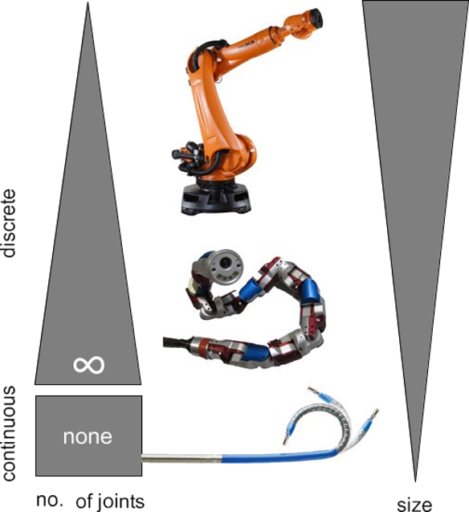
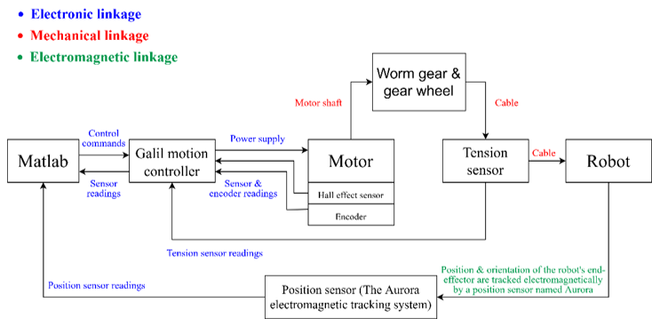
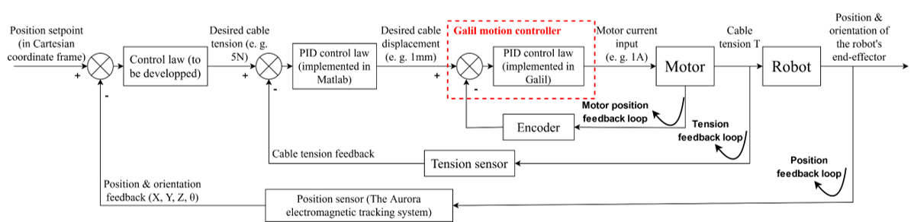
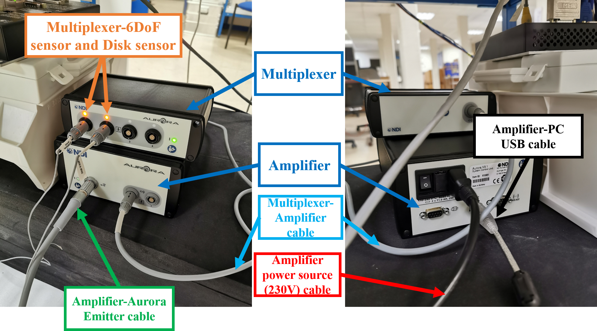
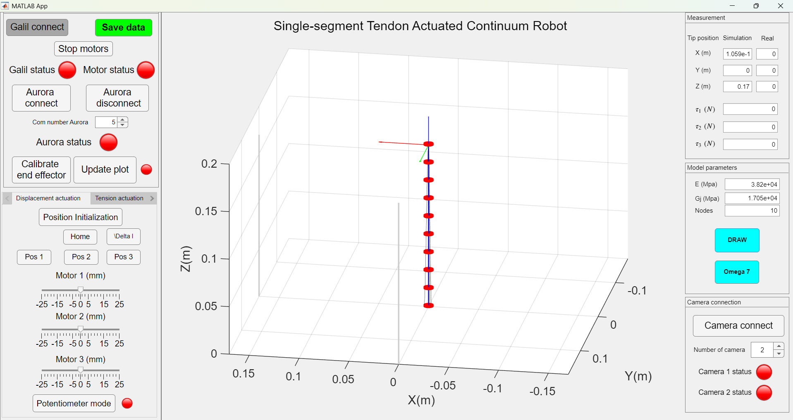

# Modeling and Shape Prediction of Tendon-Actuated Continuum Robots with Experimental Validation

This project presents the modeling, shape prediction, and experimental validation of a tendon-actuated continuum robot developed during my PhD research.

# Overview

Continuum robots are promising for minimally invasive surgery and manipulation in constrained environments.  

In such environments, continuous and accurate knowledge of the nonlinear TACR shape is essential to ensure safe guidance.Although this problem has been extensively investigated and several models have been proposed, there remains strong interest in developing
a compact model enabling fast shape prediction.

This repository presents part of my PhD research on tendon-actuated continuum robots, focusing on physically-based modeling using Cosserat rod theory, reduced-order actuation modeling, real-time shape prediction from tendon tension measurements, and experimental validation.

---

# Key Contributions

- Developed a **3D nonlinear mechanical model of tendon-actuated continuum robots based on Cosserat rod theory**.
- Proposed a **shape prediction framework using actuated strain modes (ASM)** that enables direct shape reconstruction from tendon tension measurements.
- Derived an **analytical construction of an actuation-adapted strain basis** for continuum robots with arbitrary tendon routing.
- Developed an **SVD-based method for eliminating actuation redundancy** for tendon-actuated continuum robots.
- Designed and built a **single-segment tendon-actuated continuum robot prototype platform** for experimental validation.
- Performed **extensive experimental validation for multiple tendon routing paths (parallel, convergent, spiral)**.

---

# Mechanical Modeling

Traditional robotic manipulators are typically composed of rigid links connected by discrete joints, enabling precise motion in structured environments. However, their inherent rigidity limits their ability to operate in confined or unstructured spaces.

Continuum robots address these limitations by replacing discrete joints with continuously deformable structures, allowing smooth and highly flexible motion. This transition can be interpreted as an increase in kinematic redundancy (shown in the following figure): as the number of joints increases and both their length and size decrease, the robot approaches a continuous backbone with theoretically infinite degrees of freedom [A].

Inspired by biological structures such as octopus arms and elephant trunks, continuum robots exhibit superior compliance and dexterity, making them particularly suitable for applications such as minimally invasive surgery and navigation in constrained environments.

To accurately model such continuous deformation, classical rigid-body kinematics is no longer sufficient. Instead, we adopt a geometrically exact Cosserat rod formulation to describe the robot as a continuous elastic body.

In this model, the backbone deformation is parameterized using strain fields and reduced using modal basis functions.

The mechanical modeling involves:

- nonlinear Cosserat rod modeling based on differential geometry and Lie group representations (SE(3))
- establishment of reduced Lagrangian formulation based on virtual work and Lagrangian mechanics
- construction of strain modal basis adapted to tendon routing
- fast shape prediction from tendon tension measurements by avoiding iterative shooting or Newton-Raphson solvers commonly used in Cosserat-rod models.

Under the proposed actuated strain basis, the strain field can be directly expressed as:

$$
\epsilon(X) = \Phi_a(X)T
$$

The robot configuration is then obtained by integrating the Cosserat kinematics:

$$
g' = g(\xi_0 + B\epsilon)^\wedge
$$

which is referred to as our shape prediction model. 

$g(X) \in SE(3)$: pose (orientation + position) of the robot cross-section at arc-length $X$

---

# Prototype Platform

The prototype platform was fully designed, implemented, and experimentally validated during my PhD research, covering mechanical design, embedded control, multi-sensor integration, and software development.

## System Architecture

The experimental platform integrates actuation, sensing, control, and perception modules:

- Actuation: DC motors driven by a Galil motion controller
- Proprioceptive sensing: tendon tension measurement via load cells and motor encoders
- Exteroceptive sensing: electromagnetic pose tracking using the NDI Aurora system (6-DoF sensors + reference sensor)
- Vision-based measurement: stereo camera for external shape validation and feature extraction
- Real-time control and data processing implemented in MATLAB

The overall hardware architecture is illustrated below:

## Control Framework

A multi-loop control architecture is implemented:

- Outer loop: shape / position control
- Inner loop: tendon tension regulation
- Motor-level PID control via Galil controller

This enables stable and accurate control of the continuum robot.

## Sensor Setup

As a representative example, we present the NDI Aurora electromagnetic tracking system used for real-time pose estimation.

The pose (position + orientation) of the robot end-effector is measured using: NDI Aurora electromagnetic tracking system (6-DoF), combining miniature sensors and a reference sensor to provide real-time pose estimation of the robot end-effector

NDI Aurora system setup:

The system relies on a multiplexer and amplifier to handle multiple sensors, with real-time data acquisition via USB interface.

Technical specifications of the sensors can be found in the datasheets provided in the `/docs` folder.

## Fabrication and assembly

Example of CAD of the Effector:

Effector with different routing paths (parallel, convergent, and spiral):

Single-segment tendon-actuated continuum robot prototype used for experiments:

## Human-Machine Interface

A custom MATLAB-based graphical user interface (GUI) was developed to enable full system operation and experimental workflow:

- System connection and status monitoring (motors, Aurora sensors, cameras, tension sensors)
- Real-time control of tendon actuation (displacement and force control modes)
- Online visualization of the robot 3D shape and simulation results
- Real-time acquisition and display of multi-sensor data (Aurora pose, tendon tension, encoder feedback)
- Integration with stereo vision system for external measurement and validation
- Interactive simulation module based on Cosserat Rod model and using physical parameters (e.g., Young's modulus E and shear modulus G)

This interface provides a unified platform for control, sensing, simulation, and experimental validation.

---

# Experimental Demonstration

Dynamic demonstration (.gif): 

Continuum robot prototype using parallel routing path:

Continuum robot prototype using convergent routing path:

Continuum robot prototype using spiral routing path:

For the full experimental demonstration video, click the following link: https://youtu.be/ANYyFetR3QI

# Experimental Results

The proposed modeling and shape prediction method was experimentally validated on a continuum robot prototype with multiple tendon routing paths.

Example of shape prediction results:

# Applications

Potential applications include:

- Minimally invasive surgical robotics
- Inspection in constrained environments
- Flexible robotic manipulation
- Aerospace inspection robots

---

# Technologies Used

**MATLAB**

**Python (OpenCV)**

**Computer vision**: stereo camera calibration, image segmentation

**Mechanical Design**: CAD design (SolidWorks)

**Prototyping and Fabrication**: 3D printing (IdeaMaker), mechanical assembly, and prototype integration

**Experimental Validation**: tendon tension sensing (load cells), electromagnetic pose tracking (NDI Aurora System), cameras

---

# Reference

[A] J. Burgner-Kahrs, D. C. Rucker, and H. Choset, “Continuum robots for medical applications: A survey,” IEEE Transactions on Robotics, vol. 31, no. 6, pp. 1261–1280, 2015.

---

# Related Publications

Z. Zhang, M. T. Chikhaoui, V. Lebastard, F. Boyer  
**Shape Prediction of Tendon-Actuated Continuum Robot Using Standard Proprioception** 
IEEE Robotics and Automation Letters (under review)

Z. Zhang  
**Modeling, Shape Prediction, and Actuation Redundancy Elimination of Tendon-Actuated Continuum Robots**  
PhD Thesis, IMT Atlantique (2026)

---

# Contact

Zibo Zhang  
PhD in Robotics (IMT Atlantique / Université Grenoble Alpes)

Email: zibo.zhang@imt-atlantique.fr / zibo.zhang@univ-grenoble-alpes.fr / zibo.zhang@tsm-education.fr 
